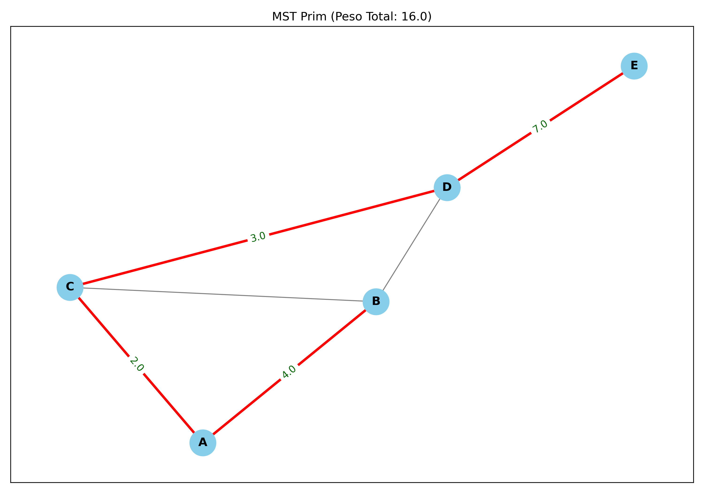
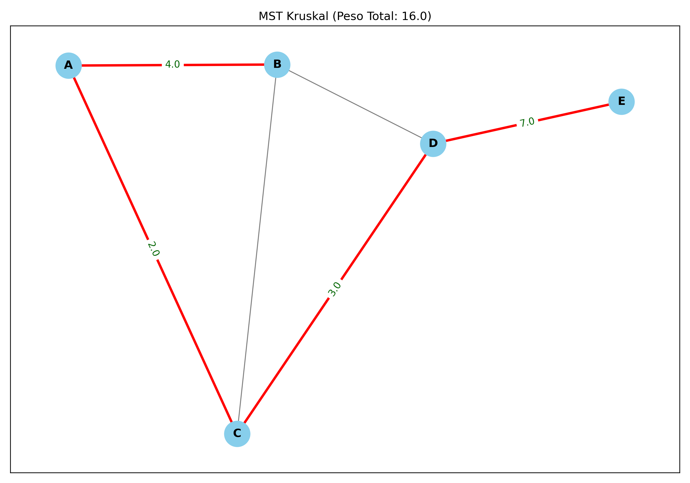
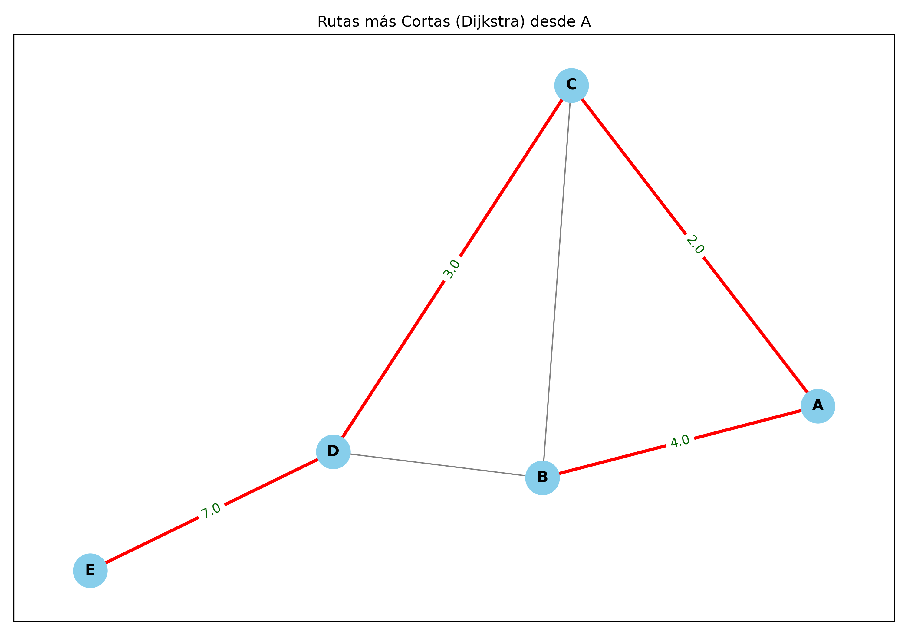
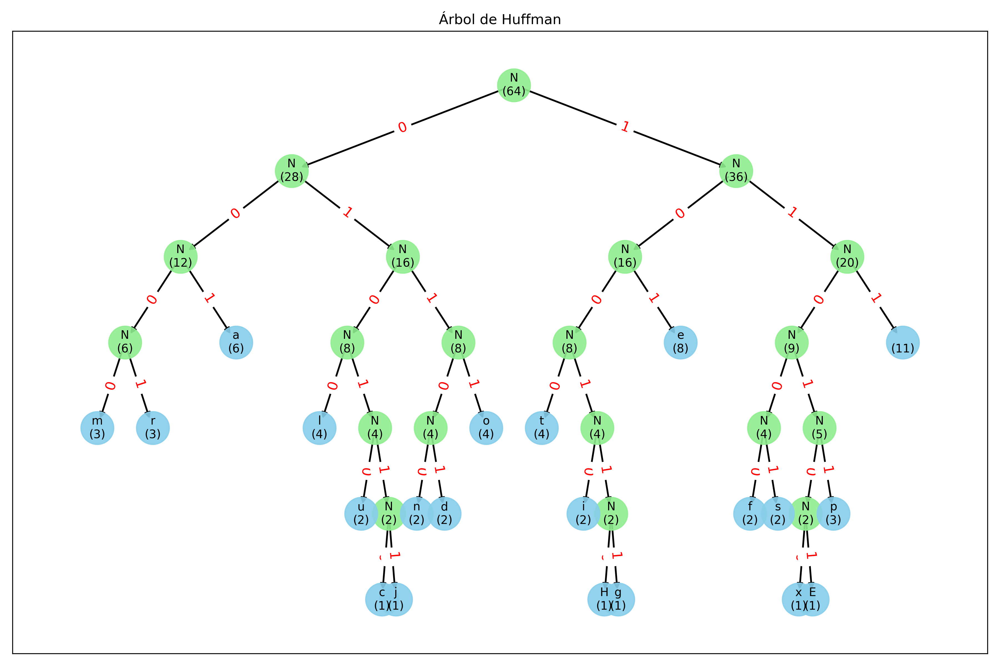
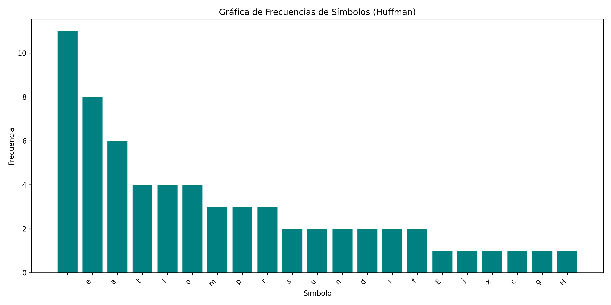

# 🎓 Proyecto Final: Análisis de Algoritmos Avanzados

---

## A. Portada del Proyecto

| Detalle | Información |
| :--- | :--- |
| **Universidad** | Universidad Da Vinci De Guatemala |
| **Curso** | Análisis de algoritmos |
| **Proyecto** | Proyecto Final: Implementación y Análisis de Algoritmos de Optimización de Grafos y Compresión |
| **Autor** | Francisco Gudiel |
| **Carnet** | 202200158 |
| **Fecha** | Diciembre, 2025 |

---

## B. Objetivos

### Objetivo General
Implementar, analizar y comparar la eficiencia de los **algoritmos fundamentales** de la teoría de grafos (Prim, Kruskal, Dijkstra) y compresión de datos (Huffman), demostrando su aplicación práctica en la solución de problemas de optimización y utilizando estándares de desarrollo profesional (**Docstrings**, complejidad Big O, y **Gitflow**).

### Objetivos Específicos
1.  **Implementar** las funciones principales de Prim, Kruskal, Dijkstra y Huffman en Python, asegurando el cumplimiento estricto del estándar de documentación **PEP-257 (Docstrings)**.
2.  **Determinar y comentar** la complejidad asintótica (**Big O**) de cada algoritmo, justificando el uso de estructuras de datos que optimizan el rendimiento (e.g., colas de prioridad y Union-Find).
3.  **Generar evidencia visual** (imágenes PNG) de los resultados obtenidos (MST, rutas más cortas y Árbol de Huffman) para validar la correcta ejecución de los algoritmos.
4.  **Aplicar el flujo de trabajo GitFlow** de manera rigurosa para gestionar el versionamiento del proyecto, incluyendo ramas `feature`, `release`, `hotfix` y *tags* obligatorios.

---

## C. Explicación Teórica de los Algoritmos

### I. Algoritmo de Prim (Árbol de Expansión Mínima - MST)
El algoritmo de Prim es un algoritmo **codicioso (greedy)** que encuentra un **Árbol de Expansión Mínima (MST)** para un grafo no dirigido y ponderado. Su enfoque consiste en construir el MST paso a paso, comenzando desde un nodo arbitrario y expandiendo el árbol mediante la adición de la **arista de menor peso** que conecta un nodo del árbol ya construido con un nodo aún no incluido. Este proceso garantiza que, en cada etapa, se toma la decisión localmente óptima.

### II. Algoritmo de Kruskal (Árbol de Expansión Mínima - MST)
Kruskal busca un MST, pero se centra en las **aristas**. El algoritmo ordena todas las aristas del grafo por peso de forma ascendente y las añade al MST una por una, **solo si** la adición de la arista no forma un ciclo con las aristas ya incluidas. La eficiencia en la detección de ciclos se logra mediante la estructura de datos **Union-Find (Conjuntos Disjuntos)**.

### III. Algoritmo de Dijkstra (Rutas más Cortas)
El algoritmo de Dijkstra es un algoritmo codicioso utilizado para encontrar el **camino más corto** desde un nodo de origen único hacia todos los demás nodos en un grafo con pesos de arista no negativos. Utiliza una **cola de prioridad** (heap) para seleccionar eficientemente el nodo más cercano aún no procesado y el proceso de **relajación** ajusta las distancias de los vecinos si se encuentra una ruta más corta a través del nodo actual.

### IV. Algoritmo de Huffman (Codificación Óptima)
El algoritmo de Huffman es un método de **codificación por prefijos de longitud variable** utilizado para la **compresión de datos sin pérdida**. Su objetivo es asignar códigos binarios cortos a los símbolos que aparecen con mayor frecuencia. Esto se logra construyendo un **árbol binario** (Árbol de Huffman) basado en las frecuencias de los símbolos, utilizando una **cola de prioridad** para combinar repetidamente los dos nodos o subárboles de menor frecuencia.

---

## D. Complejidad Teórica (Notación Big O)

| Algoritmo | Estructura Clave | Complejidad Teórica | Justificación |
| :--- | :--- | :--- | :--- |
| **Prim** | Cola de Prioridad (Min-Heap) | $O(E \log V)$ | Dominada por la adición y extracción de hasta $E$ aristas al heap. |
| **Kruskal**| Ordenación y Union-Find | $O(E \log E)$ | Dominada por el paso de ordenación. Las operaciones de Union-Find son casi $O(1)$ amortizado ($O(\alpha(V))$). |
| **Dijkstra**| Cola de Prioridad (Min-Heap) | $O(E \log V)$ | Similar a Prim. Se realizan $V$ extracciones y hasta $E$ operaciones de relajación e inserción. |
| **Huffman**| Cola de Prioridad (Min-Heap) | $O(n \log n)$ | Dominada por la construcción del árbol, donde $n$ es el número de símbolos únicos. |

---

## E. Formato de Entrada

Los archivos de entrada están ubicados en la carpeta `data/`.

| Algoritmo | Archivo | Formato | Descripción |
| :--- | :--- | :--- | :--- |
| **Grafos** | `data/grafos/ejemplo_grafo.csv` | CSV: `origen, destino, peso` | Grafo no dirigido y ponderado. |
| **Huffman** | `data/textos/ejemplo_texto.txt` | TXT: Texto plano | El contenido es analizado para la frecuencia de cada símbolo. |

---

## F. Ejecución del Programa

El programa principal (`main.py`) gestiona un menú interactivo.

1.  **Requisitos:** Asegurar que las dependencias (`networkx`, `matplotlib`, `pygraphviz` - opcional) estén instaladas.
2.  **Ejecución:** Ejecutar el archivo principal desde el directorio raíz del proyecto:
    ```bash
    $ python main.py
    ```
3.  **Interacción:** Seleccionar la opción deseada (1, 2, 3 o 4). Para **Dijkstra**, el programa solicitará el nodo de origen.
4.  **Salida:** Los resultados se imprimen en la consola, y las imágenes se guardan automáticamente en la ruta **`docs/evidencias/`**.

---

## G. Imágenes PNG Generadas (Evidencia Visual y Análisis)

Todas las imágenes se generan de forma programática por el módulo `src/utils.py` y se almacenan en el directorio `docs/evidencias/`. Estas visualizaciones sirven como **evidencia empírica** de la correcta implementación y ejecución de cada algoritmo sobre los datos de prueba.

| Algoritmo | Archivo Generado | Descripción Detallada de la Evidencia Visual | Visualización |
| :--- | :--- | :--- | :--- |
| **Prim (MST)** | `docs/evidencias/prim_mst.png` | Muestra el grafo de entrada completo, donde las aristas seleccionadas para formar el **Árbol de Expansión Mínima (MST)** por el algoritmo de Prim están **resaltadas en color rojo y con mayor grosor**. Las etiquetas de peso solo se muestran en las aristas seleccionadas. |  |
| **Kruskal (MST)** | `docs/evidencias/kruskal_mst.png` | Similar a Prim, esta figura valida el resultado del algoritmo de Kruskal. Las aristas que pertenecen al **MST** (seleccionadas sin formar ciclos) están **resaltadas en rojo**. Esto confirma que ambos algoritmos (Prim y Kruskal) llegan a la misma solución óptima. |  |
| **Dijkstra** | `docs/evidencias/dijkstra_paths.png` | Ilustra los **caminos más cortos** desde el nodo de origen especificado por el usuario. Las aristas que forman parte de la trayectoria mínima hacia **todos** los nodos alcanzables están **resaltadas en rojo/azul**. La imagen confirma la solución del problema de la ruta de origen único. |  |
| **Huffman (Árbol)** | `docs/evidencias/huffman_tree.png` | Representación de un **grafo dirigido y jerárquico** del Árbol de Huffman. Los nodos internos contienen la suma de frecuencias, y los nodos hoja contienen el símbolo y su frecuencia original. Las aristas están etiquetadas con '0' o '1', lo que define los **códigos de prefijo binario** para cada símbolo. |  |
| **Huffman (Frecuencia)** | `docs/evidencias/huffman_freq.png` | Gráfico de barras que presenta la **distribución de frecuencias** de los símbolos únicos extraídos del texto de entrada. La visualización está ordenada de forma descendente, lo que justifica la asignación de códigos más cortos a los símbolos con barras más altas (mayor frecuencia). |  |
---

## H. Flujo Gitflow Aplicado

El proyecto se gestionó siguiendo estrictamente el modelo **GitFlow**, asegurando un historial limpio y profesional que separa el desarrollo de la producción.


### Ramas y Commits Clave

| Tipo de Rama | Ramas Creadas | Propósito |
| :--- | :--- | :--- |
| **Long-Lived** | `main`, `develop` | `main` (Producción estable), `develop` (Integración de nuevas features). |
| **Feature** | `feature/prim`, `feature/kruskal`, `feature/dijkstra`, `feature/huffman` | Desarrollo aislado de cada algoritmo. Todas mergearon a `develop`. |
| **Release** | `release/v1.0.0` | Bifurcación de `develop` para la validación final. |
| **Hotfix** | `hotfix/readme-correction` | Corrección inmediata del nombre del autor en el `README.md` aplicada directamente a `main` y luego mergeada a `develop`. |

### Tags Obligatorios

* **`v1.0.0`**: Aplicado al *commit* de *merge* de `release/v1.0.0` en la rama **`main`**, marcando la versión de producción estable y funcional.

---

## I. Conclusiones Finales

La implementación de este proyecto ha demostrado la superioridad de los algoritmos avanzados de optimización sobre los enfoques de fuerza bruta.

1.  **Eficiencia Asintótica:** La complejidad $O(E \log V)$ de Prim y Dijkstra y $O(E \log E)$ de Kruskal se consigue gracias a la integración estratégica de estructuras de datos como el **Min-Heap (Cola de Prioridad)** y el **Union-Find**. Estas estructuras reducen drásticamente el costo de las operaciones clave, permitiendo que los algoritmos escalen de manera lineal-logarítmica, crucial para el manejo de grafos grandes y densos.
2.  **Optimización Garantizada:** Algoritmos *greedy* como Prim, Kruskal y Huffman proporcionan soluciones que son **óptimas a nivel global** para sus respectivos problemas. Huffman garantiza la mínima longitud binaria promedio posible, y Prim/Kruskal garantizan el MST con el menor peso total.
3.  **Desarrollo Profesional:** El uso de **Docstrings PEP-257** y la anotación precisa de la **complejidad Big O** en el código fuente elevan la calidad y la mantenibilidad del proyecto. El versionamiento con **GitFlow** asegura la trazabilidad y la estabilidad de la rama de producción (`main`).